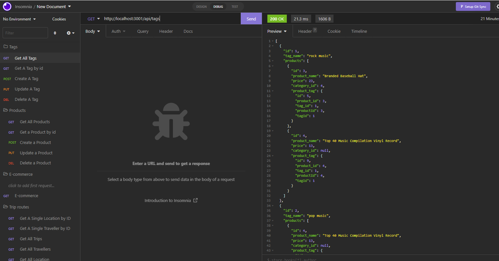

# E-Commerce-Back-End-by-Anastasia

## Table of Contents

- [Description](#description)
- [Walkthrough video links](https://drive.google.com/file/d/13Uq_1dG7J2hRW65FSyGlw0_8wZH42e9A/view?usp=sharing)
- [Installation](#installation)
- [Visuals](#visuals)
- [Technology Used](#technology-used)
- [Questions](#questions)

## Description

E-commerce is a backend application that allows to create, edit, update and delete products, categories and products tag.

## Walkthrough video link

-All GET routes return all categories, all products, and all tags being tested in Insomnia:
[Link](https://drive.google.com/file/d/17oYIZOctt7SAJuPQC6LXiEK-c6bs09Hp/view?usp=sharing) to video

-All GET routes to return a single category, a single product, and a single tag being tested in Insomnia:
[Link](https://drive.google.com/file/d/1qDC1BSXt7rqf7PDkPr6dqPxGVln6SlE1/view?usp=sharing) to video

-All POST, PUT, and DELETE routes for categories, products and tags being tested in Insomnia:
[Link](https://drive.google.com/file/d/1n9rbGSN21DJ6pEaqwtgXmnIG3yZnJO4X/view?usp=sharing) to video

## Installation

Step 1. Install npm

```
npm init -y
```

Step2.Install all modules ypu need

```
npm install express sequelize mysql
```

Step3. Create a table in sql

```
mysql -u root

SOURCE db/schema.sql;

exit
```

Step4.Nodemon for connecting to server

```
nodemon

```

## Visuals



## Technology Used

- JavaScript
- Node.js
- Sequelize
- SQL
- Express

## Questions

If you have any question about this project you can reach me at anastasiiaciloci@gmail.com
